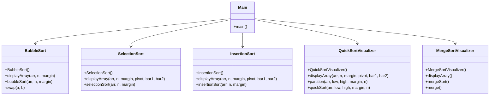

# 🌟 **Algo Visualizer** 🌟


#

[](https://github.com/ARI-900/DSA-LIBRARY)
[](CONTRIBUTING.md)


> **A visual learning platform for Sorting Algorithms in C++!**  
This project offers an engaging, animated experience to help you understand the fundamental mechanics of various sorting algorithms. By leveraging C++ along with a graphics library, it transforms abstract algorithmic concepts into clear, step-by-step visual demonstrations. Whether you are a beginner exploring the basics of BubbleSort or an advanced learner delving into QuickSort partitioning, this project provides intuitive insights into how sorting works. Each module is designed to be modular and extensible, making it easy to integrate additional algorithms or enhance existing visualizations. Embrace the world of algorithms with a tool that is as educational as it is visually appealing!


## 📖 **Table of Contents**

- [Overview](#overview)
- [Features](#features)
- [Design Diagram](#design-diagram)
- [Visualizations](#visualizations)
  - [BubbleSort](#bubblesort-visualization)
  - [SelectionSort](#selectionsort-visualization)
  - [InsertionSort](#insertionsort-visualization)
  - [QuickSort](#quicksort-visualization)
  - [MergeSort](#mergesort-visualization)
- [Installation](#installation)
- [Contributing](#contributing)
- [Author](#author)

---

## 💻 **Overview**

This project is designed to help you visually understand sorting algorithms. It provides animated visualizations for:
- **BubbleSort**
- **SelectionSort**
- **InsertionSort**
- **QuickSort**
- **MergeSort** *(Coming Soon)*

**Future plans include extending the project to include graph traversal algorithms.**

---

## 🚀 **Features**

- 📦 **Interactive Visualizations:** Step-by-step animated representations of sorting.
- 🔧 **Color-Coded Actions:** Different colors indicate active elements (swapping, pivot, etc.).
- 🌐 **Modular Design:** Each sorting algorithm is implemented as its own class.
- 🛠️ **Expandable:** Easily add more algorithms or extend to other visualization techniques.

---


## Design Diagram

Below is a class diagram that outlines the structure of the project:



#


### BubbleSort Visualization

**Description:** Animates the BubbleSort process with real-time swapping.

**Photo:**  


**Video:**  


https://github.com/user-attachments/assets/a8f78256-58ca-479d-839e-9f9601c4121a


**How It Works:**
- Array elements are shown as vertical bars.
- Bar heights indicate the values.
- Two bars are highlighted during comparisons.
- If out-of-order, bars swap positions.
- Color changes highlight active elements.
- A delay between steps lets you follow the process.


#


### SelectionSort Visualization

**Description:** Illustrates the SelectionSort algorithm by highlighting the smallest element and swapping.

**Photo:**  


**Video:**  


https://github.com/user-attachments/assets/6c2d05c4-0814-4b12-90fc-89c35256b403


**How It Works:**
- Array elements are represented as bars.
- The algorithm iterates to find the minimum element.
- The smallest element is highlighted.
- Once identified, it swaps with the first unsorted element.
- The process repeats until the array is sorted.


#


### InsertionSort Visualization

**Description:** Demonstrates the InsertionSort process with shifting and repositioning of elements.

**Photo:**  


**Video:**  


https://github.com/user-attachments/assets/e84c2f15-5f3a-433b-9bb3-72377a4db25f


**How It Works:**
- Array elements are displayed as bars.
- Starts from the second element, comparing with previous ones.
- The current element is shifted to its correct position.
- Active elements are highlighted during comparisons.
- The array gradually becomes sorted with each insertion.


#


### QuickSort Visualization

**Description:** Shows the QuickSort process with pivot selection and partitioning.

**Photo:**  


**Video:**  


https://github.com/user-attachments/assets/5e0f13c5-58a6-4c1e-8aaa-e45c5e33f62c


**How It Works:**
- Array elements are displayed as bars.
- A pivot element is selected and highlighted.
- The array is partitioned into elements less than and greater than the pivot.
- Active comparisons and swaps are animated.
- The process recurses until the array is fully sorted.


#


## Installation 🚀

Follow these simple steps to get the project up and running:

- **🔗 Clone the Repository**  
    Open your terminal and run:
  
  ```cpp
  git clone https://github.com/yourusername/SortingVisualization.git
  cd SortingVisualization
  ```

- ***💻 Compile the Project**

    Ensure you have a C++ compiler and the graphics library installed. Then, compile the project using:

  ```cpp
  g++ -o SortingVisualization main.cpp -lgraph
  ```

- ▶️ Run the Application

     Launch the program with:

    ```cpp
    ./SortingVisualization
    ```


#

### 🤝 **Contributing**
##### We ❤️ contributions!


### ***Want to contribute? Follow these simple steps:***


- 🍴 Fork the Repository:
    ```bash
    Click the "Fork" button on GitHub to create your own copy.**
    ```
- 🌿 Create a Feature Branch:
    ```bash
    // Open your terminal and run: 
    git checkout -b feature/YourFeature
    ```
- 💾 Commit Your Changes:
    ```bash
    // Stage your changes and add a meaningful commit message:
    git commit -m "Add new feature"
    ```
- 📤 Push the Branch:
    ```cpp
    // Push your branch to GitHub:
    git push origin feature/YourFeature
    ```

- 🔁 Open a Pull Request:
    ```bash
    Submit your changes for review.
    ```


---


> ***✨ If you like the project, don't forget to give it a ⭐️!***


## 💬 **Contact**
##### 🧑‍💻 Author: Arijit Chowdhury
##### 📧 Email: [arichowdhury900@gmail.com](mailto:arichowdhury900@gmail.com)
##### 🌐 GitHub: ARI-900

---
